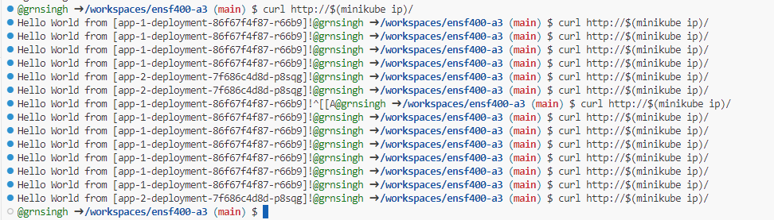
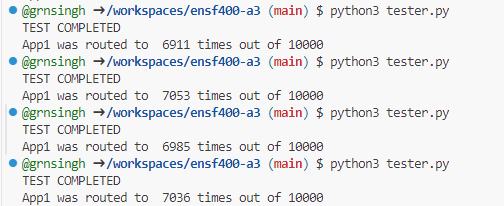

# Assignment Summary

The assignment for me started with the setup of nginx. Faced quite a few issues, but after the new containers were provided, nginx setup was easier than expected. 

## Initial Setup

There were 3 files, that I had added in initially, `nginx-configmap.yaml`, `nginx-svc.yaml` and `nginx-dep.yaml`. Once completed, `nginx-ingress.yaml` was added. 

## Ingress Installation

Took me quite a while to figure out that we need to install ingress first. 

## Service Creation

After this the only part was to create two different services, which were then tested for 70-30 canary split with the command line, and to be accurate with the results I ran a python tester script which sent requests 10,000 times and I saw results which were approximately between 69-71 percent split. 

## Results

Attached are the command line and python script results screenshots.

